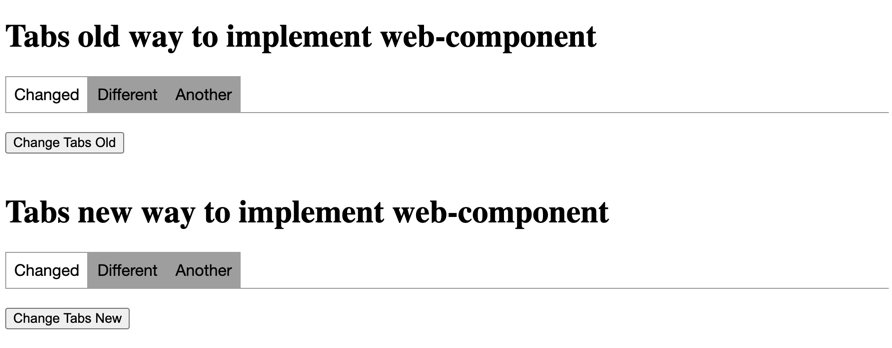

## 🛠️ Web Components with Angular Elements 


This is a repository that showcases how to create web-components in Angular with [@angular/elements](https://angular.io/guide/elements). 🚀

Angular Elements: What are they? 🤔
-----------------------------------

Angular Elements are Angular components packaged as custom elements (also known as Web Components), a web standard for
defining new HTML elements in a framework-agnostic way. They allow you to encapsulate your logic and styles in reusable
components that can be used across different applications, regardless of the underlying technology stack. 🌍

Project Structure 📂
--------------------

The repository consists of the following files and directories:

```.
├── test-web-components
│   ├── index.html
│   └── tabs-web-components.js
├── app
│   ├── app.module.ts
│   ├── tabs-new-way
│   │   ├── tabs-new-way.component.html
│   │   ├── tabs-new-way.component.scss
│   │   └── tabs-new-way.component.ts
│   └── tabs-old-way
│       ├── tabs-old-way.component.html
│       ├── tabs-old-way.component.scss
│       ├── tabs-old-way.component.ts
│       └── tabs-old-way.module.ts
└── main.ts
```

### Project Components

The repository contains two methods to create web components:

- `tabs-old-way`: The older method in which a component was included in a module.
- `tabs-new-way`: The newer method that allows for standalone components.

#### Directory `test-web-components`

- Inside `test-web-components` will be builded the `tabs-web-components.js` that contain the concat of angular builds.
- There you find also `index.html` that contain the tags of web components:

```html
...
<h1>Tabs old way to implement web-component</h1>
<tabs-old></tabs-old>

<h1>Tabs new way to implement web-component</h1>
<tabs-new></tabs-new>
...
```
<br>

#### `main.ts`

This file contains the bootstrap logic for the Angular application.

In this project, the file also includes a script that defines and registers the `tabs-new` custom element.

#### `app.module.ts`

This file defines the main module of the Angular application.

In this project, the file also includes a script that defines and registers the `tabs-old` custom element.


Getting Started 🚀
------------------

- Clone this repository:

  - `git clone https://github.com/your-username/your-project.git`

- Install the dependencies:

  - `npm install`

- Build the project:

  - `npm run build`

- Concat the js files generated by Angular build:
  - `npm run package`

- Serve the application:

  - `npm run test-components`

Result 🌐
---------


Differences 🩻
------------
The two different methods showcased in the repository demonstrate two different approaches for creating web components in Angular using `@angular/elements`.

The first method, which is referred to as the "old way", involves creating a module for the web component and then registering it with `customElements.define()` in the `ngDoBootstrap()` method of the `AppModule`.

The second method, which is referred to as the "new way", involves creating a standalone component and then registering it with `customElements.define()` outside of Angular's bootstrapping process.

Both methods ultimately result in the creation of a custom web component, but the second method allows for more flexibility in terms of when and how the component is loaded, and also allows for the component to be used outside of an Angular context.
